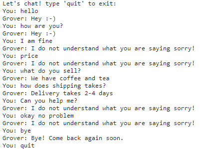

# ChatBot-in-Pytorch

It's a simple chatbot using pytorch. The user will simply give a text as input and the model will try to identify the sentence as one of the tags from the dataset. If it fails to do so it will return a sorry statement. It's fun and simple.

example:  

